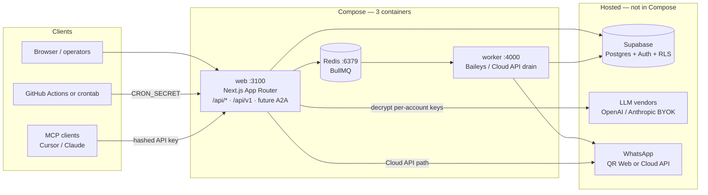
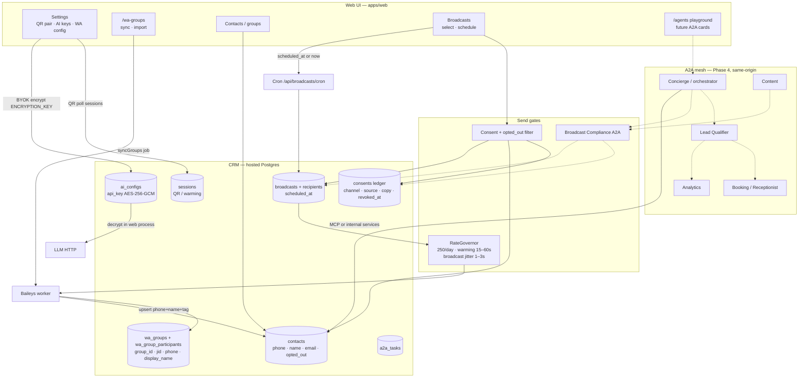
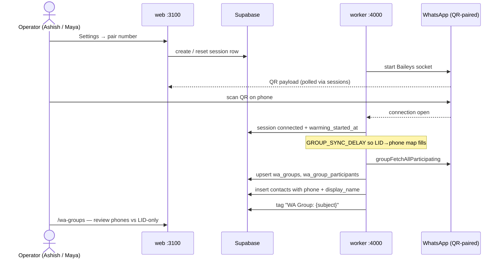
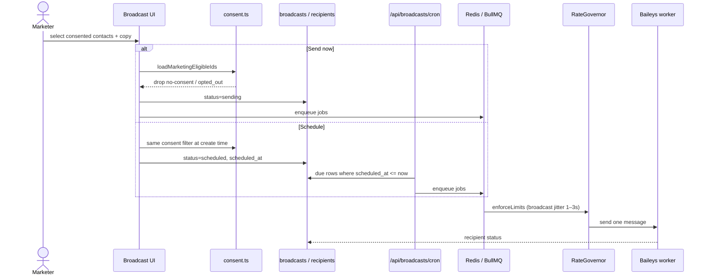
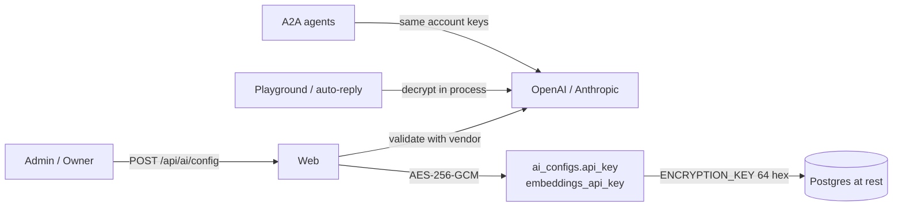

# ARCHITECTURE — AudienceGate (WhatsApp campaign CRM)

**Repo:** `shaashish1/wacrm`  
**Constraint:** 3 Compose containers + hosted Supabase. No extra runtimes.  
**Companions:** [BASELINE.md](./BASELINE.md), [production.md](./production.md), [LITE-DEPLOY.md](./LITE-DEPLOY.md), [mcp.md](./mcp.md), [PLAN-doral-healthcare.md](./PLAN-doral-healthcare.md), [PRD-doral-healthcare.md](./PRD-doral-healthcare.md)

**Public product:** AudienceGate. **First customer / tenant #1:** Doral Healthcare and Wellness (not the product name). Repo stays `wacrm`.

This file describes the **chosen** stack and the **intended** control paths. It does not implement product code. Enterprise user stories live in the [PLAN](./PLAN-doral-healthcare.md) and [PRD](./PRD-doral-healthcare.md).

---

## 1. Runtime (lite deploy)

The only production shape until explicitly changed: **web + worker + Redis + hosted Supabase**.

| Piece | Role | Port / where |
| --- | --- | --- |
| `web` | Dashboard, `/api/*`, `/api/v1`, future A2A cards + JSON-RPC | `:3100` — `GET /api/health` |
| `worker` | WhatsApp send/receive, session volume, BullMQ drain, group sync | `:4000` — `GET /health` |
| `redis` | Queues (`wwebjs-messages`, webhook-dispatch) | `:6379` |
| Hosted Supabase | Postgres, Auth, RLS, migrations `001`–current | Not in Compose |

**Not in v1 Compose:** local Postgres, Vector analytics, Edge Functions, agent sidecars, Kubernetes, a waapi-gateway.

Cron is GitHub Actions (`scheduled-jobs.yml`) or host crontab hitting existing broadcast/campaign/automation/flow routes with `CRON_SECRET` / `AUTOMATION_CRON_SECRET`. Socket.IO is optional; QR pairing polls `sessions`.

Deploy steps, Windows notes, and env rules: [production.md](./production.md), [LITE-DEPLOY.md](./LITE-DEPLOY.md).

---

## 2. Product control plane (CRM, consent, broadcasts, keys, A2A)

This is the architecture marketers and operators actually use. Solid boxes exist today. Dashed boxes are planned on this same tree.

**Rule:** Agents call MCP (or internal TypeScript services) to read/write CRM. Agents call A2A to ask another agent to reason and decide. Compliance is a **send-path gate**, not a tool wrapper. Do not expose raw `send_message` / broadcasts to the Concierge without a Compliance task success (or the equivalent server function that already exists in `lib/consent.ts`).

---

## 3. WhatsApp pairing and group extract (QR / Baileys)

**What lands in the DB today**

| Field | Source | Reliability |
| --- | --- | --- |
| Phone | `@s.whatsapp.net` JID, or LID mapped via `lidToPhone` | High if JID is a phone; **partial** if LID-only |
| Profile name | `participant.notify` / `name`, then `phoneToName`, then `lidToName` | Partial — many rows stay `null` |
| Email | `contacts.email` column exists | **Almost never from WhatsApp.** Groups do not expose email. Fill via landing form, CSV, or inbox. |
| Group ID | `wa_groups.id` (UUID) + `wa_groups.jid` on participants | High. Contacts are tagged `WA Group: {subject}`, **not** a first-class `source_group_id` column |

---

## 4. Broadcast with delay and schedule (Baileys)

**Already built:** audience select, consent gate, `scheduled_at`, cron route, BullMQ drain, `RateGovernor` (250/day, 7-day warming 15–60s, first-send 15–20s, broadcast 1–3s).  
**Gaps:** jitter is not operator-configurable; 1–3s after warming is still bursty vs Meta/WhatsApp heuristics; cron is an **external pinger** (no in-process scheduler); A2A Compliance agent is not wired yet (server function is).

---

## 5. LLM keys (BYOK) for current AI and future A2A

- Keys are **per-account**, never returned to the client (`has_key` flag only).
- Encrypt/decrypt: `apps/web/src/lib/whatsapp/encryption.ts` (GCM; legacy CBC decrypt-only).
- `ENCRYPTION_KEY` is process env, not stored in the DB. Rotate it and **all stored tokens/keys become unreadable** until re-entered.
- A2A will reuse this store. Do not add a second key table or a sidecar secrets manager in v1.

---

## 6. Example use cases (Doral Healthcare)

These are the same product, not a second stack.

### 6.1 Wellness-week marketing (Cloud API preferred for patient-facing)

Maya launches “New patient wellness week.” Landing `/p/wellness-week` captures name, phone, unchecked-by-default WhatsApp opt-in, UTM. Consent row is written. Audience = contact group ∩ active WhatsApp consent ∩ not `opted_out`. Broadcast uses a Meta **template** with STOP footer. Cloud API is the production send path. WhatsApp copy is generic (“intro consult,” “tour”) — no diagnoses, labs, or MRNs. Clinical questions escalate to phone / in-clinic intake.

### 6.2 QR-paired community number (Baileys) — extract → select → delay → schedule

Ashish pairs a **community / events** WhatsApp number via QR (Settings). The worker auto-syncs every participating group. Participants become CRM contacts: phone (when resolved), profile name (when known), email **if later available**, and Group ID (participant row + `WA Group:` tag).

Maya opens `/wa-groups`, reviews a 400-person event group, imports or uses auto-upserted phones, and **does not blast the list**. Existing imported contacts (on the order of **~4,907** in the current Doral-scale book) have **no marketing consent**. She builds an audience from people who later opted in on a landing, or she runs a lawful re-permission campaign off a HIPAA-safe / TCPA-safe channel.

She composes a broadcast, sets a **schedule** (`scheduled_at`), and the Baileys path applies **random delay** via `RateGovernor` so fan-out is not a bot-shaped burst. Cron must be alive or the job sits in `scheduled`.

### 6.3 Front-desk inbox + future A2A

Luis works Inbox. A lead replies “can I book Tuesday?” Concierge (planned) sends an A2A task to Lead Qualifier (service interest, locale, no symptom dump) then Booking (generic consult slots). If the lead pastes lab results, Qualifier escalates; text is not persisted as clinical narrative. Analytics later aggregates funnel counts — no message bodies in artifacts.

### 6.4 Operator configures models for agents

Ashish (admin) opens Settings → AI, pastes an OpenAI or Anthropic key, picks a model, tests the key, saves. Ciphertext lands in `ai_configs` for that account. Playground and future A2A specialists decrypt only in the web process. Viewers cannot write keys. Rotating `ENCRYPTION_KEY` without re-entering keys is a **priority-1 incident**.

---

## 7. A2A vs MCP

Keep **both**. They are different layers.

| | MCP (exists) | A2A (same-origin in web) |
| --- | --- | --- |
| Relationship | **Agent → tools / data** | **Agent → agent** |
| Today | `mcp-server/` → `wacrm-mcp` wrapping `/api/v1` | Cards + JSON-RPC at `/api/a2a` |
| State | Stateless tool calls | Stateful **tasks** (`submitted` → `working` → done / failed / `input-required`) |
| Contract | Tool schema | Agent Card + skills |
| Writes | Opt-in `WACRM_ENABLE_WRITES` / broadcasts | Per-skill; Broadcast Compliance is a **gate**, not a tool wrapper |
| Who | Cursor, Claude Desktop, Ashish | In-app specialists; later external cards |

v1 A2A is **same-origin** inside the web app (`apps/web/src/lib/a2a/`, cards at `/api/a2a/:agentId/agent-card.json`). No public registry, no new container. Pin JSON-RPC 2.0 subset: SendMessage, GetTask, CancelTask, GetAgentCard. Streaming optional.

---

## 8. Built vs planned (architecture view)

| Capability | Status | Where |
| --- | --- | --- |
| Lite deploy compose | Built | `docker-compose.yml`, [LITE-DEPLOY.md](./LITE-DEPLOY.md) |
| QR pair + session poll | Built | Settings + `sessions` + worker |
| Group sync + participant extract | Built | `baileys-provider.syncGroups` |
| Auto contact upsert + group tag | Built | same; `source_group_id` + `contact_wa_groups` (058); email only if WA provides it |
| Consent ledger + gated send | Built | `consents`, `lib/consent.ts` |
| Broadcast select + `scheduled_at` | Built | UI + `/api/broadcasts/cron` |
| RateGovernor jitter / daily cap | Built | `apps/worker/src/rate-governor.ts` |
| BYOK LLM keys encrypted | Built | `/api/ai/config`, `ai_configs` |
| Full `/api/v1` (groups, campaigns, consents, pipelines) | **Planned** | Phase 2 — today: me, messages, contacts, conversations, broadcasts, webhooks |
| In-process scheduler (no GitHub/cron) | **Planned** | Cron remains an external pinger |
| Configurable / higher-quality delay distribution | Built | Broadcast + account min/max seconds; RateGovernor uses payload/account |
| A2A agents + cards + task store | Built (five agents) | Compliance, Qualifier, Content, Booking, Analytics; `docs/a2a.md` |
| Group admin (add/remove/promote) | **Not built** | Phase 2, Baileys-only |
| Unified audit log / SIEM | **Gap** | Row `user_id` only |
| HA / multi-worker session lock | **Gap** | Single worker assumed |

---

## 9. Enterprise operations (required posture, not a hobby bot)

| Concern | Current | Target on this repo |
| --- | --- | --- |
| **Observability** | `GET /api/health`, `GET /health`; console logs | Structured logs (request id, account id, **phone last-4**), queue depth, send success/fail, cron heartbeat, session state |
| **Audit** | API key revoke list; `user_id` on writes | Append-only audit for consent, key rotate, broadcast create/send, role change, QR pair |
| **RBAC** | `viewer < agent < admin < owner` + RLS | Keep; add “cannot disable consent gate”; CSV export admin+ |
| **Secrets** | `ENCRYPTION_KEY`, service role server-only, LLM keys GCM | Runbook for rotation; never commit `.env`; no keys in LLM logs |
| **Backup** | Hosted Supabase PITR / dumps (operator) | Documented RPO/RTO; session volume backup; Redis AOF if durable queues required |
| **Compliance** | Consent gate + STOP; HIPAA banner required | Counsel review; WhatsApp **not** a BAA channel |
| **SLA** | Single web + single worker | Define operator SLA (e.g. 99.5% staffed-hours). Lite deploy is **not** multi-AZ HA |
| **Runbooks** | [production.md](./production.md), [LITE-DEPLOY.md](./LITE-DEPLOY.md) | Add: QR re-pair, Redis flush, stuck `scheduled`, `ENCRYPTION_KEY` mismatch, ban / 403 flood |

---

## 10. Adjacent repos — not in this architecture

`whatsapp-research` and `omnichat` are **not** services, not Compose extras, and not merge sources. Booking/consent UX may be **reimplemented** against AudienceGate contacts + a thin `appointments` table. Do not port omnichat voice, their schema, or the research apps.

---

*End of ARCHITECTURE. Product rules: [PRD-doral-healthcare.md](./PRD-doral-healthcare.md). Stories and challenges: [PLAN-doral-healthcare.md](./PLAN-doral-healthcare.md).*
