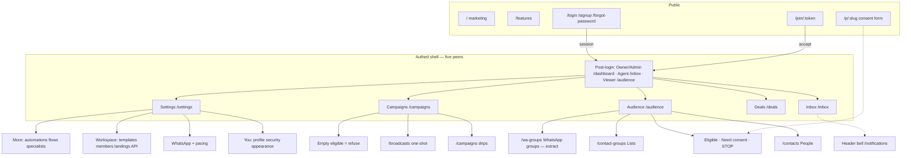

# AudienceGate — feature inventory and navigation UX

**Public product:** AudienceGate (WhatsApp campaign CRM).  
**Repo:** `wacrm`. Not a public mark.  
**Grounding:** routes, role predicates, RLS, and API scopes that ship in this tree. Wishlist items from [PLAN.md](./PLAN.md) are marked **planned** or **partial**.  
**Do not claim:** HIPAA, BAA, anti-ban warranty, or a clinic name as the product. Extract is not consent. STOP is not erasure.

Status words used below:

| Status | Meaning |
| --- | --- |
| **Shipped** | UI and/or API exist and are wired. |
| **Partial** | Core path exists; PLAN or comments name a real gap. |
| **Planned** | In PLAN / predicates / comments; not a usable operator surface yet. |

---

## A. Roles

Four human roles live in `account_role_enum` and `AccountRole` (`wacrm/apps/web/src/lib/auth/roles.ts`). Hierarchy is a flat ordinal that matches SQL `is_account_member` in `wacrm/supabase/migrations/017_account_sharing.sql` (lines 136–164): **owner (4) > admin (3) > agent (2) > viewer (1)**.

Capability predicates (same file) are the intended single source of truth:

| Predicate | Who | Meaning |
| --- | --- | --- |
| `canManageMembers` | admin+ | Invite, change roles, remove, see emails on the roster |
| `canEditSettings` | admin+ | Account-wide settings (WhatsApp, templates, pipelines, tags, custom fields, API keys, AI keys) |
| `canSendMessages` | agent+ | Operational writes: send, create contacts, move deals, run broadcasts, edit automations/flows |
| `canViewOnly` | viewer | Read-only; UI uses this for “Read-only — …” tooltips |
| `canDeleteAccount` | owner | Irreversible destroy — **predicate only; no UI found** |
| `canTransferOwnership` | owner | Hand the account to another member — **API exists; Members UI is deferred** |

UI gates: `useCan` (`wacrm/apps/web/src/hooks/use-can.ts`), `GatedButton` (`wacrm/apps/web/src/components/ui/gated-button.tsx`), `<RequireRole min>` (`wacrm/apps/web/src/components/auth/require-role.tsx`).  
Server gates: `requireRole(min)` (`wacrm/apps/web/src/lib/auth/account.ts` lines 182–189).  
Middleware (`wacrm/apps/web/src/middleware.ts`) only checks **session**, not role. Every signed-in member can open every dashboard path; buttons and APIs refuse.

**Default landing after login (all human roles today):** `/dashboard`.

- Login success: `wacrm/apps/web/src/app/(auth)/login/page.tsx` lines 73–76 → `/dashboard`, or `/join/[token]` when `?invite=` is present.
- Already-authed hit on `/login` `/signup` `/forgot-password`: middleware lines 51–69 → `/dashboard` (or `/join/[token]`).
- Sidebar logo: `/dashboard` (`sidebar.tsx` line 185).
- `/dashboard` is **not** in the five-item primary nav (`PRIMARY_NAV_HREFS` in `dashboard-nav.ts`).

Should-be landing (this spec, §C): **Owner/Admin → `/dashboard` or `/settings?tab=overview`; Agent → `/inbox`; Viewer → `/audience`.** Do not implement until a follow-up ticket.

### Owner

**For:** The account principal. One owner per account. Signup trigger seeds a personal account with the creator as owner (`017`).

**Can (in addition to everything Admin can):**

- Transfer ownership: `POST /api/account/transfer-ownership` requires `requireRole("owner")` (`transfer-ownership/route.ts` line 60). Members tab comment: transfer UI is **deferred** (`members-tab.tsx` lines 8–10). Owner row is non-editable in the roster.
- `canDeleteAccount` is true. No settings control, no API route found that deletes the account.

**Cannot:**

- Be invited as owner (`invitations/route.ts` lines 186–193; DB `CHECK (role <> 'owner')` on invitations).
- Be demoted or removed via Members UI (`members-tab.tsx` lines 332, 416, 457). Promote-to-owner is refused on `PATCH /api/account/members/[userId]` — callers are told to use transfer (`members/[userId]/route.ts` lines 74–78).

**Default landing today:** `/dashboard`.

### Admin

**For:** Trusted operators who configure the workspace and invite staff. Not the legal owner.

**Can:**

- Everything Agent can (send, campaigns, inbox, deals, automations, flows, A2A invoke).
- Invite `admin` / `agent` / `viewer`: `POST /api/account/invitations` `requireRole("admin")` (line 169).
- Change/remove non-owner members: `PATCH`/`DELETE /api/account/members/[userId]` `requireRole("admin")`.
- See member emails (`members/route.ts` line 50).
- Rename account: `PATCH /api/account` `requireRole("admin")`.
- Create/revoke API keys: `POST /api/account/api-keys` and revoke route, `requireRole("admin")` + RLS `api_keys_*` admin+ (`026_api_keys.sql` lines 71–84).
- Write WhatsApp Cloud / QR config (RLS `whatsapp_config_*` admin+, `017` lines 421–424). Pairing is admin+ per PLAN US-1.
- Trigger WA group **sync**: `POST /api/whatsapp/groups` `requireRole("admin")` (line 29). Same for `groups:admin` on `POST /api/v1/wa-groups/sync`.
- Write AI config / test key / knowledge ingest / reindex / usage: `requireRole("admin")` on `/api/ai/config` (write), `/api/ai/test`, `/api/ai/knowledge` (write), `/api/ai/knowledge/reindex`, `/api/ai/usage`.
- Meta Conversions write: `POST /api/meta-conversions` `requireRole("admin")`.
- Delete a landing: `DELETE /api/landings/[id]` `requireRole("admin")` (line 64).
- Create/edit tags and custom-field **definitions** (RLS admin+).
- Create/edit pipelines (RLS admin+). Deal **rows** remain agent+.
- Webhook endpoint insert/update/delete (RLS admin+, `028` lines 67–77). **No Settings tab** — public API only.
- See AI usage on `/agents` (`canEditSettings`).

**Cannot:**

- Transfer ownership or (today) delete the account.
- Disable the consent gate. Compliance / `lib/consent.ts` is not a role toggle.
- Invite someone as `owner`.

**Default landing today:** `/dashboard`.

### Agent

**For:** Day-to-day inbox and campaign operators (the “Luis / Maya at the keyboard” role).

**Can:**

- Send inbox messages (`useCan("send-messages")` in `message-composer.tsx` line 190). API: `/api/ai/draft`, `/api/ai/playground`, `/api/ai/autoreply/[conversationId]` are `requireRole("agent")`.
- Assign a conversation (`message-thread.tsx` updates `assigned_agent_id`).
- Create/edit/delete contacts, notes, contact-group membership, deals, broadcasts, campaigns (enroll/start), automations, flows, landings (create/patch), email templates, quick replies.
- Import from WA groups and CSV (`import-contacts`, `import-all`, `[id]/import` are `requireRole("agent")`).
- Sync WhatsApp **contacts** (`/api/whatsapp/contacts/sync` agent+). **Not** group sync (admin+).
- List WA groups via `GET /api/whatsapp/groups` (`requireRole("agent")` line 6) — viewers cannot.
- Invoke A2A JSON-RPC (`requireA2AAuth(..., 'agent')` in `lib/a2a/auth.ts` lines 25–27, 41).
- See whether AI is configured (`GET /api/ai/config` is readable; write is admin+).
- See the Members roster **without emails**.

**Cannot:**

- Invite, change roles, revoke invites, or see teammate emails.
- Edit WhatsApp tokens, send-pacing account fields (RLS), templates (RLS admin+), pipeline **definitions**, custom-field catalogue, API keys, Meta CAPI secrets, AI keys / KB write, webhook endpoints.
- Create tags on CSV import unless `canEditSettings` (`import-modal.tsx` line 261).
- Transfer or delete the account.
- Disable consent. Empty eligible set → `NO_CONSENT_MESSAGE` (`lib/consent.ts` lines 10–11).

**Default landing today:** `/dashboard` (should-be: `/inbox`).

### Viewer

**For:** Read-only stakeholders (counsel, clinic owner watching, auditor).

**Can:**

- Open every dashboard URL (middleware is session-only).
- Read contacts, conversations, broadcasts (Supabase select), campaigns list (`GET /api/campaigns` uses `getCurrentAccount`, no min role), contact-group list (`GET /api/contact-groups` same), deals, pipelines, settings **You** tabs, Members roster without emails, API key **names** (not secrets), consent ledger via RLS select.
- See Inbox threads; composer is `readOnly` (`message-composer.tsx` lines 187–191).
- See GatedButton tooltips: “Read-only — your role can't …”.

**Cannot:**

- Send, create, enroll, import, or mutate operational data. RLS blocks writes on contacts, conversations, deals, broadcasts, automations, flows (`017` insert/update/delete = agent+).
- `GET /api/whatsapp/groups` and `GET /api/landings` require **agent** — Audience WA-group counts and Settings → Landings list **fail for viewers** even though the pages are reachable. Treat as a shipped inconsistency.
- Invite, billing (there is no billing), or settings writes.

**Default landing today:** `/dashboard` (should-be: `/audience` so consent math is the first screen).

### API key / service (distinct)

**Not a fifth human role.** Keys are account-scoped bearer tokens (`wacrm_live_…`). Authorization is **scopes only**, independent of who minted the key (`lib/api-keys/scopes.ts` lines 4–8). Minting is admin+; a key with `broadcasts:send` can blast even if an agent minted it.

- Empty scopes: `GET /api/v1/me` only.
- Rate limit: 120 req/min per key, in-process (`docs/public-api.md`).
- A2A: header that looks like an API key must carry `a2a:invoke`; session cookies use `requireRole` instead (`lib/a2a/auth.ts`).
- Service role: worker, cron, inbound Meta webhook — not a dashboard user.

Scopes that ship (`API_SCOPES`):  
`messages:send|read`, `contacts:read|write`, `conversations:read`, `broadcasts:send`, `webhooks:manage`, `a2a:invoke`, `groups:read`, `groups:admin` (sync only), `consents:read`, `contact-groups:read|write`, `campaigns:read|send` (enroll/pause/resume — **does not send WhatsApp**), `pipelines:read|write`, `landings:read|write`.

**Default “landing”:** none. Integrators call `/api/v1/me`.

---

## B. Full feature catalog

Grouped by product area. Roles: **O**wner, **A**dmin, **G**ent (agent), **V**iewer, **K**ey (API). “Use” means the role can complete the action; “see” means read / gated UI.

### Auth and account

#### Sign in — `/login`

Email + password. Invite query `?invite=` forwards to `/join/[token]` after success. Already-signed-in users bounce to `/dashboard`. **Shipped.** All humans. No consent implication.

#### Create account — `/signup`

New personal account; trigger seeds owner. Invite query supported. Password min 6. **Shipped.**

#### Forgot password — `/forgot-password`

Session-less reset. Authed users redirected to `/dashboard`. **Shipped.**

#### Accept invite — `/join/[token]`

Peek → sign up / sign in / Accept. Does **not** auto-redeem. Roles on the token: admin / agent / viewer only. **Shipped.** Middleware leaves this public so anonymous invitees are not forced through the dashboard shell (`join/layout.tsx` comment).

#### Marketing site — `/`, `/features`, `/terms`, `/privacy`

Public. Category line: WhatsApp campaign CRM. Features log: consent gate, Compliance refuse, STOP, specialists. Sign-in / create-account CTAs. **Shipped.** Not the operator app.

#### Dashboard home — `/dashboard`

Metrics (active conversations, new contacts, open deal value, messages sent), charts, activity, quick actions to Inbox / Audience / Campaigns / Deals. **Shipped.** Hidden from the five-item nav. Any member can view. Edge: widgets fail independently and log; empty charts are empty, not invented.

---

### Inbox

#### Inbox — `/inbox` (`?c=<conversationId>`)

Three-pane: conversation list, thread, contact sidebar (tags / deals / notes; desktop panel remembered in `localStorage`). Realtime + resync on visibility. WhatsApp disconnected banner. **Shipped.**

- **Who:** V see; G+ send and assign.
- **Consent:** 1:1 service replies are not the marketing gate. STOP on inbound still opts the contact out (`lib/opt-out.ts`, worker inbound). Do not re-ask STOP in-thread.
- **Edge:** Cloud API 24h session window disables free-form / media (`message-composer.tsx` `sessionExpired`). Viewers get a disabled composer with a reason. Deep link `/inbox?c=` opens the thread.

#### Composer extras (same route)

Text, media, voice (Ogg/Opus), templates, quick replies, “draft with AI” (`POST /api/ai/draft` agent+). **Shipped** (AI draft needs BYOK). Auto-reply pause / assign-to-me: `POST /api/ai/autoreply/[conversationId]` agent+.

#### Notifications — `/notifications`

In-app list (assignment, broadcast sent/failed/scheduled). Mark all read. Click assignment → `/inbox?c=`. Realtime. **Shipped, orphaned:** not in primary nav; `useUnreadNotifications` is unused in chrome. Sidebar badge is **unread conversations**, not this table (`use-total-unread.ts`).

---

### Audience

Section nav (`AUDIENCE_NAV` in `section-nav.tsx`): Audience · People · Lists · WhatsApp groups.

#### Audience home — `/audience`

Counts: book size, lists, synced groups, eligible (active WA consent ∩ not opted out), need-consent, STOP. Consent-gate legend. Copy: extract is stored; it is not a send list. **Shipped.**

- **Who:** all members. WA-group count uses `GET /api/whatsapp/groups` (**agent+**) — Viewer may see “—” for groups.
- **Consent:** this screen **is** the gate. Empty eligible is a first-class number, not a hidden error.
- **Edge:** failed counts stay blank (`formatCount` → "—"). Not guessed.

#### People — `/contacts`

Paginated book, search, tag filter, consent label (eligible / need_consent / stop), add/edit/delete, detail (notes PHI-scanned), CSV import, custom-fields manager (admin). **Shipped.**

- **Who:** V see; G+ mutate; A+ create tags on import and open custom-field catalogue.
- **Consent:** import does **not** write `consents`. CSV is CRM only.
- **Edge:** import reports imported / skipped / failed. Duplicates skipped. WhatsApp almost never provides email (PLAN US-1).

#### Lists — `/contact-groups`

Static lists and smart segments. **Shipped.**

- **Who:** V list via `GET /api/contact-groups`; G+ create/update/members (`requireRole("agent")`).
- **Consent:** a list is not a send set. Enroll/broadcast still ∩ consent.
- **Edge:** smart groups cannot be hand-mutated (`/api/v1` returns 400).

#### WhatsApp groups (extract) — `/wa-groups`

Synced Baileys groups, participants, phone vs LID-only, import selected / import all, admin sync. **Partial** (extract + import shipped; add/remove/promote **planned** — PLAN Phase 2, `public-api.md` roadmap).

- **Who:** G+ list/import via dashboard API; A+ enqueue sync. V can open the page; list API is agent+.
- **Consent:** **Extract ≠ consent.** Import upserts contacts; LID-only stay visible and are not invented as contacts. Tags like `WA Group: {subject}` — durable `source_group_id` still a PLAN gap (US-1).
- **Edge:** email empty is success. Re-sync idempotent. Community announce: extract OK; do not spam.

---

### Campaigns and broadcasts

Section nav (`CAMPAIGNS_NAV`): Campaigns · Broadcasts.

#### Drip campaigns — `/campaigns`

List, create/edit (channel, delayed steps), start/enroll, delete. Start calls `POST /api/campaigns/[id]/start` → enroll helper (consent skip counts). **Shipped** (UI is simpler than `/api/v1` pause/resume).

- **Who:** V list; G+ write. Key: `campaigns:read` / `campaigns:send`.
- **Consent:** enroll skips opted-out and anyone without an active consent row for the channel. Empty set → `400` `no_consent` / `NO_CONSENT_MESSAGE`. Cron re-checks at fire. Create is draft and does not send.
- **Edge:** `campaigns:send` **does not send WhatsApp** — it writes enrollments; cron is the queue.

#### Broadcasts — `/broadcasts`, `/broadcasts/new`, `/broadcasts/[id]`

One-shot template or plain-text fan-out, schedule, recurrence, per-recipient status, cron heartbeat hint. **Shipped.**

- **Who:** V see list (RLS select); G+ create (`useCan("send-messages")`). Key: `broadcasts:send`.
- **Consent:** `loadMarketingEligibleIds` / `filterMarketingEligible`. Empty → refuse. STOP between schedule and fire honored on cron (`broadcasts/cron`).
- **Edge:** scheduled + stale cron → “waiting on scheduler”, not failed (`broadcasts/page.tsx` + `/api/health`). Baileys jitter is pacing, not a ToS warranty. Cloud API path does not pretend Baileys jitter applies (PLAN US-2). Cap 1000 recipients on v1 POST.

---

### Deals / pipelines

#### Deals board — `/deals` (re-exports `/pipelines`)

Kanban, create deal, edit pipeline (admin). **Shipped.**

- **Who:** V see; G+ create/move/delete deals; A+ create/rename pipelines (RLS + `useCan("edit-settings")`).
- **Consent:** none on the board. Deal **notes** are PHI-scanned (`phi_denied` on v1).
- **Edge:** `/pipelines` still works as a deep link; header title is “Deals”.

#### Deal currency — `/settings?tab=deals`

Default currency. Admin write. **Shipped.**

---

### Settings (every `?tab=`)

Rail + `?tab=` (`settings-sections.ts`). Default `overview`. Legacy `tags` / `custom-fields` → `fields`. Unknown → overview. Comment says `adminOnly` items are hidden — **the rail does not hide any section** (`settings-rail.tsx`). Agents/viewers see every chip; writes fail or cards go read-only.

| Tab | Route | What it does | Who | Status |
| --- | --- | --- | --- | --- |
| Overview | `?tab=overview` | Status chips, WhatsApp health, member/template/tag counts | All see; invite counts admin+ | Shipped |
| Profile | `?tab=profile` | Name, avatar. Sidebar account menu also links here | Self | Shipped |
| Login & security | `?tab=security` | Password + active sessions | Self | Shipped |
| Appearance | `?tab=appearance` | Theme / mode. Header `ModeToggle` is a second control | Self | Shipped |
| WhatsApp / Cloud API | `?tab=whatsapp` | Provider `meta` \| `wwebjs`, tokens, register, QR pair (`WWebJSConfig`), webhook URL | All see; A+ write (RLS) | Shipped |
| Send pacing | `?tab=pacing` | Broadcast jitter min/max; unofficial rate **preset** on session (`antibanPreset` in code — **do not market as anti-ban**) | All see; persist is account/session RLS | Partial (jitter shipped; PLAN still wants richer policy) |
| Templates | `?tab=templates` | Meta HSM lifecycle, local drafts, PHI scan on copy | All see; A+ write (RLS) | Shipped |
| Quick replies | `?tab=quick-replies` | Canned inbox replies | G+ write (`requireRole("agent")`) | Shipped |
| Fields & tags | `?tab=fields` | Tags (all see); custom-field catalogue (admin card) | Tags A+ write; fields A+ | Shipped |
| Deals & currency | `?tab=deals` | Default currency | A+ write | Shipped |
| Team members | `?tab=members` | Roster, invite, role change, revoke. Transfer **deferred** | All see roster; A+ mutate | Partial |
| Landings | `?tab=landings` | Create/publish `/p/[slug]`, copy public URL | G+ (`useCan` + landings API agent+). V: API 403 | Shipped |
| API keys | `?tab=api` | Create (once), revoke, scopes | All see names; A+ create/revoke | Shipped |
| Meta Conversions | `?tab=meta` | CAPI pixel/token | A+ write | Shipped |

**Not a Settings tab (shipped elsewhere or API-only):** AI/BYOK + knowledge (`/agents`), outbound webhooks (`/api/v1/webhooks`), automations, flows, notifications, billing (**none** — privacy copy mentions processors only if billing exists).

---

### Automations

#### Automations — `/automations`, `/new`, `/[id]/edit`, `/[id]/logs`

Trigger → steps (welcome, OOO, lead qualifier, follow-up). Toggle, duplicate, delete. Cron: `/api/automations/cron`. **Shipped. Hidden from primary nav.**

- **Who:** V see list (RLS select); G+ mutate (`requireRole("agent")`).
- **Consent:** automations that send marketing must still hit send-path consent. Do not treat this builder as a consent bypass.
- **Edge:** `send_webhook` is SSRF-checked. Assign-conversation fires `conversation_assigned` notifications.

---

### Flows

#### Flows — `/flows`, `/flows/[id]`, `/flows/[id]/runs`

Keyword / first-inbound / manual graphs. Soft-GA (beta chip only; per-account gate removed). Cron: `/api/flows/cron`. **Shipped. Hidden from primary nav.**

- **Who:** V see; G+ create/activate (`requireRole("agent")`).
- **Consent:** inbound keyword flows are service-path; do not use them to cold-market the imported book.
- **Edge:** empty graph / dangling edges skipped in the runner.

---

### Specialists / A2A / AI

PLAN US-10 still says “Not built.” **That line is stale.** Cards, JSON-RPC, PHI scan, and five specialists ship.

#### Specialists playground — `/agents`

Tabs: Playground, Setup (BYOK + knowledge), Usage (admin+). Intro copy: specialists + tools, not a chatbot; consult / intro / tour only. **Shipped. Hidden from primary nav.**

#### A2A HTTP — `POST /api/a2a`, `GET /api/a2a/:agentId/agent-card.json`

Agents: `compliance`, `qualifier`, `content`, `booking`, `analytics` (`lib/a2a/cards.ts`). Methods: `message/send`, `tasks/get`, `tasks/cancel`, `agents/list`. Session = agent+; key = `a2a:invoke`. **Shipped.**

- **Compliance:** preflight audience, review copy (PHI + STOP footer), enforce opt-out. Hard gate language. Never auto-sends.
- **Qualifier:** interest / score / PHI leak. No symptom dump.
- **Content:** draft WA/email/landing. Never auto-sends.
- **Booking:** generic slots only. No reason-for-visit.
- **Analytics:** aggregates only; no message bodies.

**Partial vs PLAN:** no Concierge router as a sixth agent; no public registry; no SSE. Keys reuse `ai_configs` (US-4).

#### BYOK + knowledge

`/api/ai/config` GET strips secrets (`has_key`). Write/test admin+. Knowledge ingest/reindex admin+; GET any member. Playground/draft/auto-reply agent+. **Shipped.** Fail closed if the vendor is down — inbox still works.

---

### Landings (public consent)

#### Public form — `/p/[slug]` (alias `/l/[slug]` → redirect)

Published row only. Checkbox copy stored verbatim + IP/UA (`recordConsent`). Footer: Powered by AudienceGate. Clinic name from the **landing row**, not the product chrome. **Shipped.**

- **Who:** anonymous leads.
- **Consent:** this is the lawful-yes path. Does not send WhatsApp. Does not backfill the imported book.
- **Edge:** unpublished → 404. Slug globally unique (409). `robots: noindex`. Default copy refuses clinical channel (`lib/landings.ts`).

Operator CRUD: Settings → Landings + `/api/v1/landings`.

---

### API keys + `/api/v1` + webhooks

Documented in [public-api.md](./public-api.md). **Shipped** for the table there. **Deferred:** Baileys group-admin actions; templates and flows not on v1.

Webhook events: `message.received`, `message.status_updated`, `conversation.created`. Durable queue (`063`), cron `/api/webhooks/cron`. HTTPS + SSRF deny. Secret shown once. **No dashboard UI** — Settings does not list endpoints. Admin+ via RLS; keys need `webhooks:manage`.

---

### WhatsApp Cloud vs QR

One `provider_type` per account (`meta` | `wwebjs`) in Settings → WhatsApp. **Shipped.**

| | Cloud API (`meta`) | QR / Baileys (`wwebjs`) |
| --- | --- | --- |
| Pair | Phone number ID, WABA, token, PIN, `/register` | QR on worker session; poll `sessions` |
| Inbound | Meta webhook `/api/whatsapp/webhook` | Worker socket → same inbox tables |
| Groups extract | Limited | `syncGroups`, `/wa-groups` |
| Marketing send | Templates + Meta limits | RateGovernor 250/day + jitter |
| Risk | Official | Unofficial — ban risk is real; **not a warranty** |

PLAN recommendation: Cloud API for lead-facing marketing; QR retained for extract + community number. Do not dual-send the same audience.

---

### Send pacing

Settings → Send pacing + `RateGovernor` (`apps/worker/src/rate-governor.ts`):

- Daily cap 250 (Baileys path).
- Warming 7 days: 15–60s jitter.
- First send after connect: 15–20s (in-memory; resets on worker restart).
- After warming: account `broadcast_jitter_*` (default 1–3s) + pause every 25 sends (8–15s).

**Shipped / partial.** Configurable min/max exists; PLAN still wants non-uniform quality and business-hours. UI copy must say **pacing**, not anti-ban. Cloud API does not use this governor.

---

### PHI deny-list

`lib/a2a/phi.ts`: SSN, MRN, insurance, license, diagnosis/meds/labs, symptom-prompt phrasing. Used on A2A artifacts, notes, KB, templates, deal notes. **Partial** (PLAN US-5): account-JSON extra terms and inbox banner still open. **Not HIPAA.** Refuse message: WhatsApp and this CRM are not HIPAA channels.

---

### Health / cron (ops)

Not operator nav. **Shipped** as endpoints:

| Probe | Path | Notes |
| --- | --- | --- |
| Web liveness | `GET /api/health` | `{ ok, last_cron_at, cron_stale }` — stale if last OK > 15 min |
| Worker | `GET :4000/health` | `{ ok, service: "worker" }` |
| Broadcasts due | `/api/broadcasts/cron` | `CRON_SECRET` |
| Campaigns due | `/api/campaigns/cron` | Re-checks consent |
| Automations | `/api/automations/cron` | |
| Flows | `/api/flows/cron` | |
| Webhook drain | `/api/webhooks/cron` | |

Lite compose: web `:3100`, worker `:4000`, Redis, hosted Supabase (PLAN US-9). Single worker invariant for Baileys. If cron is down, scheduled rows wait — UI should say that (broadcasts page already does).

---

### Consent / STOP (cross-cutting)

**Shipped:** `consents` ledger (057), landing capture, broadcast/campaign refuse, STOP → `opted_out` + revoke, v1 `consents:read` (never grants).  
**Partial:** email List-Unsubscribe (PLAN US-7); re-permission program for the imported book (do **not** backfill).  
**Planned:** content calendar (P1).

Audience math: **contact group ∩ active WhatsApp consent ∩ not `opted_out`**. Compliance (function + A2A card) can refuse. Group membership is not consent.

---

## C. Navigation UX (should-be IA)

Keep the **five-item shell**. That is the product bet (`dashboard-nav.ts` comment: consented campaign work, not a 13-item catalog). Design below is **should-be**; call out **as-shipped** when they differ.

### Primary nav — order, badges

| Order | Item | Href | Badge | Who sees it |
| --- | --- | --- | --- | --- |
| 1 | Inbox | `/inbox` | Unread **conversation** count (dot today; should-be a number if >9 then `9+`) | All. Agent’s home. |
| 2 | Audience | `/audience` | Optional: STOP count only if >0 (refuse color). Do **not** badge “need consent” as unread — that is a work queue, not a ping. | All. Viewer’s home. |
| 3 | Campaigns | `/campaigns` | None. Refuse state lives **inside** the section (empty eligible), not as a red nav lie. | All. Viewer: item stays; Send is gated with reason. |
| 4 | Deals | `/deals` | None | All |
| 5 | Settings | `/settings` | None (or “pair WhatsApp” dot for admin+ when disconnected) | All. Depth varies. |

Do **not** add Automations, Flows, Agents, Notifications, Dashboard, WA Groups, or Anti-Ban to this list.

**As-shipped:** Inbox unread is a 2px dot without a count (`sidebar.tsx` lines 212–236). No role filtering. Logo → `/dashboard`.

### Section nav

**Audience** (keep, copy only):

1. Audience (hub + consent math) — `/audience`
2. People — `/contacts`
3. Lists — `/contact-groups`
4. WhatsApp groups — `/wa-groups`  
   Label stays **WhatsApp groups**, never “WA Groups”. First line on that page remains “Extract is not consent.”

**Campaigns:**

1. Campaigns (drips) — `/campaigns`
2. Broadcasts (one-shot) — `/broadcasts`  
   Viewer: both visible; “New” is `GatedButton` with “your role can't create broadcasts / campaigns.”

**Deals:** no section nav. Pipeline settings live in Settings → Deals & currency. `/pipelines` remains a synonym.

**Settings rail** (should-be groups):

| Group | Items | Role |
| --- | --- | --- |
| (top) | Overview | All |
| You | Profile, Login & security, Appearance | All |
| WhatsApp | WhatsApp / Cloud API, Send pacing | All see; admin+ write. Viewer: read-only status. |
| Workspace | Templates, Quick replies, Fields & tags, Deals & currency, Team members, Landings, API keys, Meta Conversions | Hide **API keys, Meta, Landings write, Templates write** from Viewer **or** show disabled with reason. Prefer **show + disabled** so the gate is visible. |
| More | Automations, Flows, Specialists (`/agents`) | Agent+ see Automations/Flows; admin+ see Specialists setup/usage. Viewer: omit More, or one disabled row “Operator tools”. |
| Account (owner) | Transfer ownership (when UI exists) | Owner only |

`?tab=` stays the deep-link contract. Add `?tab=more` only if More is a panel; otherwise More rows are **links** to `/automations`, `/flows`, `/agents` (not fake tabs).

**As-shipped:** no More group; those routes are unlinked. Rail does not hide admin sections. Account menu Settings goes to `?tab=whatsapp` (pairing), Profile to `?tab=profile`.

### Buried vs promoted

| Promote | Why |
| --- | --- |
| Inbox | Agent’s job. Unread is the only chrome badge. |
| Audience hub + Eligible / Need consent / STOP | The company is the gate. Do not bury consent behind People. |
| Campaigns + Broadcasts as peers under one item | One “send” mental model; two mechanics. |
| Settings Overview | Admin/Owner first minute: is WhatsApp paired? |
| Landings inside Settings | Consent capture is configuration, not a sixth primary item. |

| Bury (Settings → More or header) | Why |
| --- | --- |
| Automations, Flows | Power tools. Daily path is Inbox + Campaigns. |
| Specialists / `/agents` | BYOK + cards. Not “AI Agents” in the sidebar. |
| `/dashboard` | Useful charts; not a fifth peer. Logo or Overview can link it. |
| `/notifications` | Header bell. Assignment is an Inbox event. |
| Webhooks, API keys | Integrator surfaces. |
| Send pacing | WhatsApp group in Settings. Never “Anti-Ban”. |
| QR vs Cloud | One WhatsApp tab, two radios. |

**Role-based promotion:**

- **Viewer:** five items, but Campaigns Send and Audience Import are disabled-with-reason. Settings You + Overview + read-only WhatsApp status. No More.
- **Agent:** lives in Inbox. Settings You + Quick replies. WhatsApp/API/Members visible but write-blocked (as today) **or** hidden — prefer visible + disabled so they know who to ask.
- **Admin/Owner:** full Settings depth + More. Overview is the pairing checklist.

### Header

One row:

1. Skip link (already: `#main-content` in `dashboard-shell.tsx` lines 44–48). Keep.
2. Mobile hamburger (already).
3. **One title** from the primary family (already `header.tsx`). Map `/contacts` `/wa-groups` `/contact-groups` → Audience; `/broadcasts` → Campaigns (today header says “Broadcasts” — should-be **Campaigns** so the shell does not fork); `/pipelines` → Deals; `/automations` `/flows` `/agents` → Settings.
4. **Header actions (right):** theme toggle (keep) + **notification bell** → `/notifications` (count from `useUnreadNotifications`) + **nothing else**.
5. **Account menu: sidebar footer only.** Do not add a second avatar in the header. Menu: Profile (`?tab=profile`), Settings (`?tab=overview` — not WhatsApp), Sign out. Show account name + role chip when the account name ≠ `full_name` (already).

### Mobile

- Drawer from the left (already). Escape + backdrop + route-change close (already). Body scroll lock (already).
- **Should-be:** `inert` (and `aria-hidden`) on the `<aside>` when closed on viewports below `lg`, so focus cannot land on off-screen links. Today the aside is only translated (`-translate-x-full`) and is **not** inert.
- Section nav wraps (`flex-wrap` already). Settings rail is a horizontal scroller on small screens and auto-scrolls the active chip (already).
- Inbox: list → thread is already a mobile stack; keep contact panel behind a toggle.

### Deep links

| Pattern | Meaning |
| --- | --- |
| `/inbox?c=<id>` | Open thread (shipped) |
| `/settings?tab=<section>` | Settings panel (shipped). Legacy `tags` / `custom-fields` → `fields` |
| `/join/<token>` | Invite (shipped) |
| `/login?invite=` | Sign-in then join (shipped) |
| `/p/<slug>` | Public landing (shipped). `/l/<slug>` redirects |
| `/broadcasts/[id]` | Broadcast detail |
| `/automations/[id]/edit`, `/flows/[id]` | Buried tools; prefetch still listed in `DASHBOARD_NAV_HREFS` |

Prefetch every authed path including buried ones (`DASHBOARD_NAV_HREFS`) so a bookmarked `/flows` still warms the shell.

### Role-based hiding vs disabled

**Rule:** if the user can **see the outcome** (a campaign, a landing, a send refusal), show the destination. If they cannot **act**, show the control disabled with `GatedButton` / `title="Read-only — your role can't …"`.

- **Do not hide Campaigns** from Viewer. Hide **Send** / **New**.
- **Do hide** Settings → More (Automations / Flows / Specialists) from Viewer.
- **Do hide** API-key **create** (already). Showing the roster of key names is OK.
- **Do not** hide the consent refuse. Empty eligible is a page, not a toast they might miss.

Fix shipped holes when implementing: Viewer `GET` for landings and WA groups should be **read** (`getCurrentAccount`) so the pages they can open actually load.

### Information architecture

### Per-role first 60 seconds

**Owner (new account)**  
1. Land `/dashboard` (or Overview).  
2. Settings → WhatsApp: pick Cloud API (recommended) or QR. Pair.  
3. Settings → Landings: publish `/p/wellness-week`. Copy the URL.  
4. Audience: eligible is `0` until a lead checks the box. That is success, not a broken import.  
5. Members: invite an Agent. Do not invite as owner.

**Admin (invited)**  
1. Overview: is WhatsApp connected?  
2. Templates + pacing.  
3. Audience: confirm extract vs eligible.  
4. Campaigns: preview eligible vs skipped. Do not send the imported book.  
5. API keys only if an integrator is waiting.

**Agent**  
1. **Should-be:** `/inbox`. Unread dot.  
2. Reply or assign. Composer disabled only if viewer or 24h window.  
3. Audience → People to attach a note (PHI refuse if it looks clinical).  
4. Campaigns only after Admin says the landing is live; Start will refuse an empty consent set — that message is the product.  
5. Do not look for “WA Groups” as a primary item; it sits under Audience.

**Viewer**  
1. **Should-be:** `/audience`. Eligible / Need consent / STOP.  
2. Open a campaign: read counts; New is disabled with a reason.  
3. Inbox: read threads; cannot send.  
4. Settings: own profile + appearance. Members names, no emails.  
5. No More tools.

### Empty states and consent refuse (first-class)

These are destinations, not failures to hide:

| State | Where | Copy principle |
| --- | --- | --- |
| No WhatsApp pair | Settings Overview + Inbox banner | “Connect WhatsApp to receive. Sending still needs consent.” |
| Book > 0, eligible = 0 | Audience hub + Campaigns preview | “Extract is stored. It is not a send list.” + link to Landings. |
| Enroll/broadcast refuse | Campaigns / Broadcasts / API `no_consent` | `NO_CONSENT_MESSAGE` verbatim. Link to `/audience` and `/settings?tab=landings`. |
| STOP | Audience STOP fact + contact label | “Honored. Never re-ask in-thread.” |
| LID-only | `/wa-groups` | “No phone. Not invented as a contact.” |
| Scheduled, cron stale | Broadcasts | “Waiting on scheduler.” |
| Viewer CTA | Any GatedButton | “Read-only — your role can't …” |
| PHI hit | Notes, templates, deals, A2A | `PHI_REFUSE_MESSAGE`. Not a HIPAA certification. |

### Anti-patterns to reject

1. **13-item flat nav** — Inbox, Contacts, Groups, WA Groups, Campaigns, Broadcasts, Deals, Pipelines, Automations, Flows, Agents, Notifications, Settings. The shell already rejected this (`PRIMARY_NAV_HREFS`).
2. **Jargon “WA Groups”** — say WhatsApp groups; lead with extract ≠ consent.
3. **“AI Agents” in the sidebar** — specialists live under Settings → More / `/agents`. Concierge is not the company.
4. **“Anti-Ban”** as a nav item or badge — pacing is a Settings paragraph. `antibanPreset` is an internal field name; do not surface it.
5. **Duplicate account menus** — avatar in header **and** sidebar. One footer menu.
6. **Mesh / skill-mesh branding** — brand-context forbids Meshgate and peers. Product is the gate + specialists.
7. **Hiding Campaigns from Viewer** — they need to see that sends are refused, not that the product has no campaigns.
8. **Hiding empty eligible** — the gate is the demo.
9. **HIPAA in chrome** — Settings may state WhatsApp is not a HIPAA channel; never name the product HIPAA.
10. **Doral / tenant clinic as the mark** — landings carry clinic copy; chrome is AudienceGate.
11. **Second Settings entry that opens WhatsApp** while the primary Settings item opens Overview — pick Overview for the word “Settings”; put pairing on Overview’s WhatsApp chip.
12. **Dashboard as a sixth primary item** after login — keep it as a logo/overview target.
13. **Badge inflation** — one Inbox badge. Not badges on Campaigns, Audience, and Settings at once.

---

## D. Open questions / leftovers

### Automations, Flows, Specialists: Settings “More” vs own nav

**Recommendation: Settings → More (links, not a sixth/seventh/eighth primary item).**

Rationale, grounded in what ships:

1. The five-item shell is already coded as the IA (`PRIMARY_NAV_HREFS`). Adding three peers recreates the 13-item catalog the comment rejected.
2. **Agent** time is Inbox + occasional Campaigns. Automations/Flows are configuration; they already sit behind `requireRole("agent")` and GatedButtons, not behind a need to be always visible.
3. **Specialists** are BYOK + same-origin cards. Putting “Agents” in the primary nav invites chatbot positioning that `brand-context.md` forbids. `/agents` stays a deep link from More + Overview.
4. **Viewer** should not hunt operator tools. More is omitted for them.
5. **Admin/Owner** already treat Settings as the depth surface (14 tabs). Three more links in a More group is cheaper than teaching a new top-level IA.
6. Prefetch and middleware already know `/automations` `/flows` `/agents` — burying them does not delete them.

Reject: a “Tools” primary item that expands a mega-menu (mobile drawer becomes a maze). Reject: leaving them **unlinked** (today’s state) — that is how features rot.

### Other leftovers (do not invent; ticket later)

| Item | Reality |
| --- | --- |
| Transfer ownership UI | API + predicate; Members comment says deferred |
| Delete account | Predicate only |
| Billing | None. Do not add a Billing nav item |
| Webhooks settings tab | API + RLS only |
| Notification bell | Hook exists; unused |
| `inert` on closed drawer | Not implemented |
| Viewer read APIs for landings / WA groups | Pages reachable; GET requires agent |
| Settings `adminOnly` rail hiding | Comment only |
| Email List-Unsubscribe | PLAN US-7 |
| Group admin add/remove/promote | PLAN Phase 2 |
| Durable contact ↔ group lineage | Partial (tags + `contact_wa_groups` migration 058; US-1 still names gaps) |
| Concierge router agent | Not in `A2AAgentId` |
| Inbox PHI banner / extra deny terms | PLAN US-5 |
| Post-login role-based home | All roles → `/dashboard` today |
| Header title “Broadcasts” vs family “Campaigns” | As-shipped fork |
| CSV export of the book | Import exists; PLAN P0-8 wants export admin+ — **do not claim export ships** |

---

## Appendix — gated actions cheat sheet

| Action | Min role | Where |
| --- | --- | --- |
| Send inbox / broadcast / enroll campaign | agent | `canSendMessages`; `requireRole("agent")` on write routes |
| Import WA / CSV | agent | `import-*` routes; contacts `useCan` |
| Sync WA groups | admin | `POST /api/whatsapp/groups` line 29; `groups:admin` |
| Pair / edit WhatsApp | admin | RLS `whatsapp_config_*` |
| Invite / change role / revoke | admin | `/api/account/invitations`, `members/[userId]` |
| See member emails | admin | `members/route.ts` line 50 |
| API keys create/revoke | admin | `/api/account/api-keys`; RLS |
| AI keys / KB write / usage | admin | `/api/ai/*` |
| Meta CAPI write | admin | `/api/meta-conversions` |
| Pipeline definitions | admin | RLS + pipelines page |
| Tags / custom field defs | admin | RLS; Fields panel |
| Landing delete | admin | `landings/[id]` DELETE line 64 |
| Landing create/patch | agent | `landings` routes; panel `useCan("send-messages")` |
| Transfer ownership | owner | `POST /api/account/transfer-ownership` |
| Delete account | owner | Predicate only |
| A2A invoke | agent or `a2a:invoke` | `lib/a2a/auth.ts` |
| Disable consent gate | nobody | Server ledger |

---

*Source of truth for navigation work. Implement UI in a separate change. Do not send WhatsApp from this document.*
